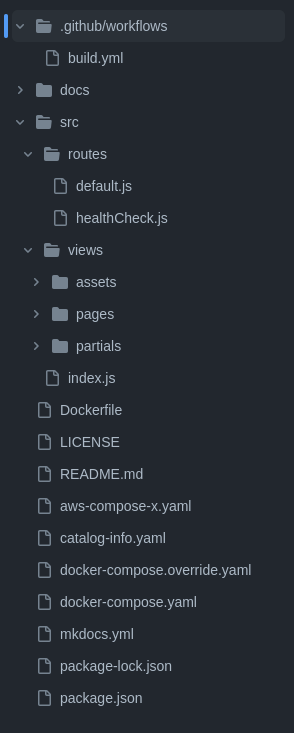
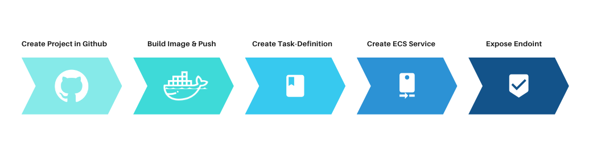
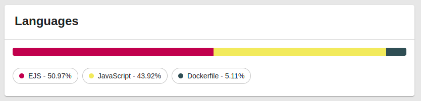
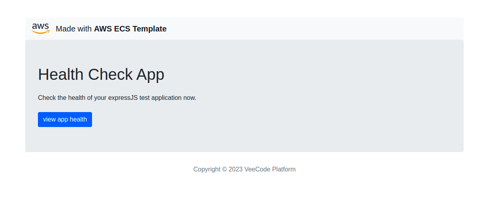

# AWS ECS Template

**The project is a template for provisioning the ECS on AWS, using ECR to build the image of an ExpressJs application.**

### Project structure

### Flux

### Project Details

### Deploy

### Pipeline Secrets
For the project to run as expected, it is necessary to configure some secrets in the pipeline.

🔑 AWS_ACCESS_KEY `mandatory`  
🔑 AWS_SECRET_KEY `mandatory`  
🔑 AWS_REGION `mandatory`  
🔑 DOCKER_PASSWORD `mandatory`  
🔑 DOCKER_USERNAME `mandatory`  
