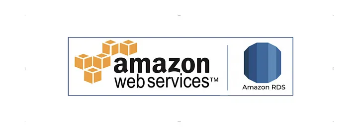
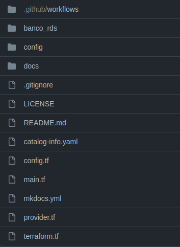
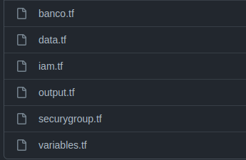
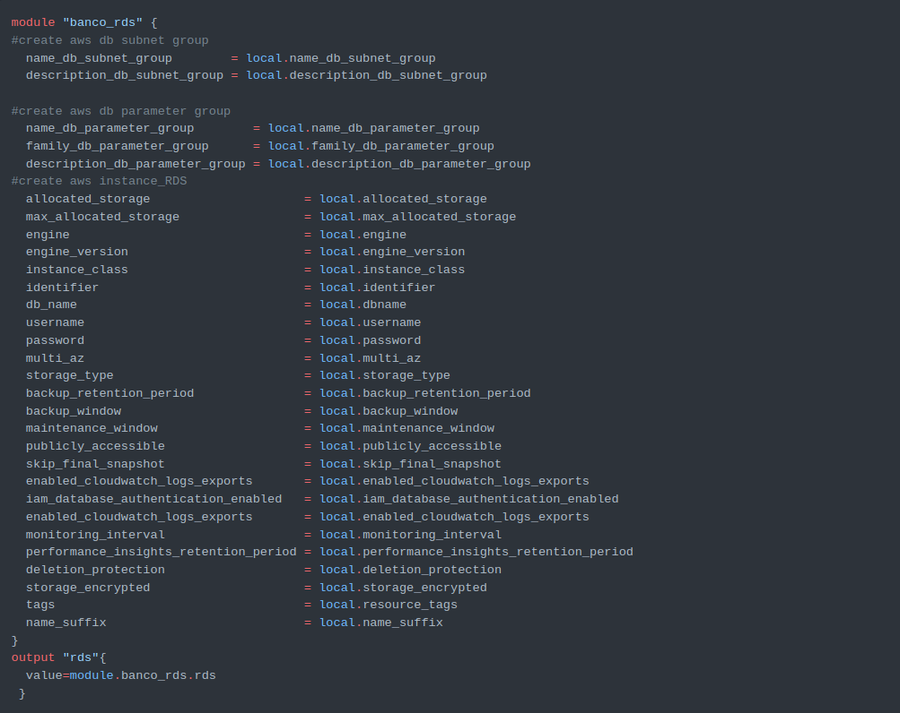

# GitOps | Amazon Web Services - RDS Template

**The GitOps project is a template for provisioning the RDS on AWS.**

  

  

### Project structure

### github/workflows

- Where are the github actions files.

### banco_rds

- The following structure follows:

> All these terraform files will be powered by the `defaults.yml` file found in the `config` folder.

### config

- Where the `defaults.yml` file is centralized, it will receive user inputs and transform them into variables to feed the files in the `banco_rds` folder.

### docs

- Where we find the project documentation, by default it will come with basic information, but the user will be able to add details about the final project, and this documentation will be visible within the devportal when the project is cataloged (a process that happens when it is generated) .

> It is important to say that the documentation listens to every change that is made in the code repository, so it will always remain up to date.

### OBS

> After performing the clone of the repository, it is necessary to configure three environment variables in the repository, namely: `AWS_ACCESS_KEY`, `AWS_SECRET_KEY` and `AWS_REGION`. These variables are the Access Key **ID**, **Secret Access Key**, and **AWS Region**. To learn how to create the keys, visit <a href="https://docs.aws.amazon.com/IAM/latest/UserGuide/id_credentials_access-keys.html#Using_CreateAccessKey">the official documentation</a>.

- With the environment variables defined in the repository, it is now possible to run the pipeline for provisioning the RDS cluster, but there is a default provisioning configuration located in config/defaults.yml that can be changed according to the user's needs.

### Root Project

- In the root of the project, we have some very important files:

| File              | Explanation                                                                                                                                                                                                                                                                            |
| ----------------- | -------------------------------------------------------------------------------------------------------------------------------------------------------------------------------------------------------------------------------------------------------------------------------------- |
| **.gitignore**       | File in which we add the exceptions that will not be versioned by git.                                                                                                                                                                               |
| **LICENSE**      | the License to use the software.                                                                                                                                                                                                                  |
| **README.md**      | The Project Readme                                                                                                                                                                                                                  |
| **catalog-info.yaml**       | The File responsible for cataloging the project within the devportal.                                                                                                                                                                                                                  |
| **config.tf**      | Terraform file that references the `config` folder, where the variables that will feed the project are set.                              |
| **main.tf**      | In this file we have all the project properties, which are being referenced by the variables created with the received inputs.                              |
| **mkdocs.yaml**      | This file is responsible for uploading your project's documentation into the devportal catalog.                              |
| **provider.tf**      | File that receives the variable referring to the Region, this must be set via github actions.                                                                                                                                                                                                                  |
| **terraform.tf** | File that holds terraform version information. |

### Example of `main.tf` file

**pipeline**

The pipeline is divided into 2 workflows, namely:

**Deploy:** Provisions infrastructure via Terraform.

**Destroy (manual execution):** Destroys the infrastructure.

---