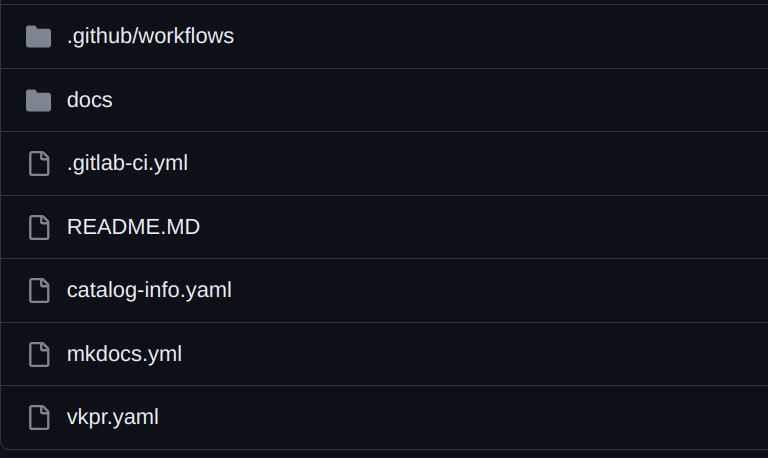

# Access Stack Template

## Getting started

**This template utilizes the VKPR CLI to perform the installation of a stack for proxy configuration with NGINX Ingress Controller, certificate management with Cert-Manager through Let's Encrypt, and employs External-DNS to handle annotations for new ingresses.**

### Project structure

## Guide

The `docs` folder will contain the application documentation. It must be edited later according to the project being developed, and this documentation will be available within the **Devportal**.

It is necessary to configure the Github/Gitlab Secret in the project repository, so that the spec is published.

Already in the root of the project are the configuration files.

It is important to emphasize that according to the template, it can be created according to demand and following the architecture that the developer requests.

---

## Pipeline Secrets
For the project to run as expected, it is necessary to configure some secrets in the pipeline, all are mandatory.

:key: AWS_ACCESS_KEY `mandatory`  
:key: AWS_SECRET_KEY `mandatory`  
:key: AWS_REGION `mandatory`  
:key: CLUSTER_NAME `mandatory`  
:key: AWS_HOSTEDZONE_ID `mandatory`  
