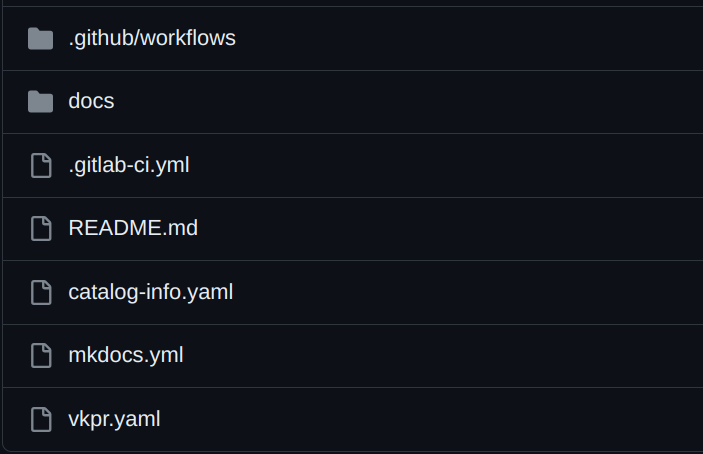

# Ingress Stack Template

## Getting started

**This template provides a comprehensive automation solution for configuring infrastructure, traffic routing, DNS records, and SSL/TLS certificates in a Kubernetes environment on AWS.**

**This template installs the Nginx Ingress Controller on a Kubernetes cluster in AWS. It enables you to create an ingress controller that manages traffic routing for your Kubernetes-based applications. It also automatically creates an Elastic Load Balancing (ELB) managed Load Balancer from AWS, distributing traffic among pods running relevant services in your cluster.**

**This template also installs ExternalDNS, a tool that automates DNS record configuration. In the context of AWS, ExternalDNS is commonly used to automatically update DNS records on Amazon Route 53, AWS's DNS service. When a change occurs in Kubernetes resources, such as creating a new Ingress or modifying a service, ExternalDNS detects the change. Based on the detected change information, ExternalDNS generates or updates DNS records on Amazon Route 53. Through AWS APIs, the ExternalDNS controller authenticates itself using appropriate credentials (such as AWS access keys) to perform update operations. For example, if you create an Ingress for a service on a specific domain, ExternalDNS can create a corresponding DNS record in Route 53 to direct traffic to the correct IP address of the service.**

**However, when it comes to certificates, this template utilizes Cert Manager, a tool for SSL/TLS certificate management in Kubernetes environments. It employs the DNS-01 challenge validation method, commonly used in certificate issuance processes via the ACME (Automated Certificate Management Environment) protocol, often used for obtaining SSL/TLS certificates automatically, such as those provided by Let's Encrypt. When a certificate request is initiated, Cert Manager automatically initiates the validation process. This involves creating DNS TXT records containing challenge values provided by the certificate issuer (Let's Encrypt). Cert Manager then verifies if the DNS TXT records have been created correctly and are accessible. After successful validation, the certificate issuer emits the SSL/TLS certificate, which is stored in Kubernetes as a Certificate resource.**

**In summary, this template offers a comprehensive automation for deploying and managing the Nginx Ingress Controller, ExternalDNS, and Cert Manager on a Kubernetes cluster in AWS. It streamlines traffic routing, automatic DNS record updates, and automated issuance of SSL/TLS certificates, making application infrastructure configuration and maintenance much more efficient and secure.**

## Pipeline Secrets
For the project to run as expected, it is necessary to configure some secrets in the pipeline, all are mandatory.

:key: AWS_ACCESS_KEY `mandatory` <br>
:key: AWS_SECRET_KEY `mandatory` <br>
:key: AWS_REGION `mandatory` <br>
:key: CLUSTER_NAME `mandatory` <br>
:key: AWS_HOSTEDZONE_ID `mandatory` <br>

## Example of an IAM policy

Please note that this is a basic example and should be adapted to your specific needs and security requirements

```
{
    "Version": "2012-10-17",
    "Statement": [
        {
            "Effect": "Allow",
            "Action": [
                "elasticloadbalancing:CreateLoadBalancer",
                "elasticloadbalancing:DescribeLoadBalancers",
                "elasticloadbalancing:DeleteLoadBalancer"
            ],
            "Resource": "*"
        },
        {
            "Effect": "Allow",
            "Action": [
                "route53:ChangeResourceRecordSets",
                "route53:ListResourceRecordSets",
                "route53:GetChange"
            ],
            "Resource": "*"
        },
        {
            "Effect": "Allow",
            "Action": [
                "acm:RequestCertificate",
                "acm:DescribeCertificate"
            ],
            "Resource": "*"
        },
        {
            "Effect": "Allow",
            "Action": [
                "eks:DescribeCluster"
            ],
            "Resource": "*"
        }
    ]
}
```

## Guide

The `docs` folder will contain the application documentation. It must be edited later according to the project being developed, and this documentation will be available within the **Devportal**.

It is necessary to configure the Github/Gitlab Secret in the project repository, so that the spec is published.

Already in the root of the project are the configuration files.

It is important to emphasize that according to the template, it can be created according to demand and following the architecture that the developer requests.

---

### Project structure


